# Procesverslag
Markdown is een simpele manier om HTML te schrijven.  
Markdown cheat cheet: [Hulp bij het schrijven van Markdown](https://github.com/adam-p/markdown-here/wiki/Markdown-Cheatsheet).

Nb. De standaardstructuur en de spartaanse opmaak van de README.md zijn helemaal prima. Het gaat om de inhoud van je procesverslag. Besteedt de tijd voor pracht en praal aan je website.

Nb. Door *open* toe te voegen aan een *details* element kun je deze standaard open zetten. Fijn om dat steeds voor de relevante stuk(ken) te doen.

## Jij

  
uitwerken voor kick-off werkgroep

  ### Auteur:
  Tom van Droffelaar

  #### Je startniveau:
  Rood

  #### Je focus:
  Responsive
 

## Je website

  
uitwerken voor kick-off werkgroep

  ### Je opdracht:
  Aston Martin
  https://www.astonmartin.com/en/

  #### Screenshot(s) van de eerste pagina (small screen): 
  Aston Martin - Home
  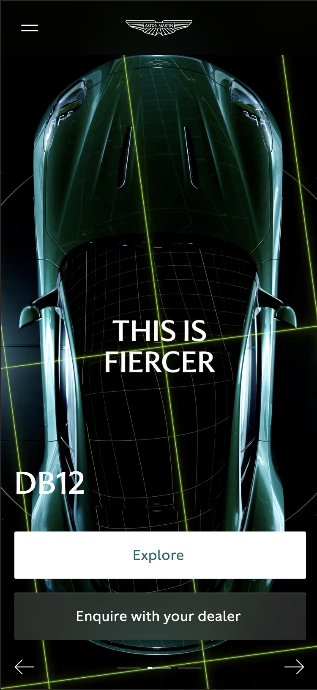

  #### Screenshot(s) van de tweede pagina (small screen):
  Aston Martin - Store  
  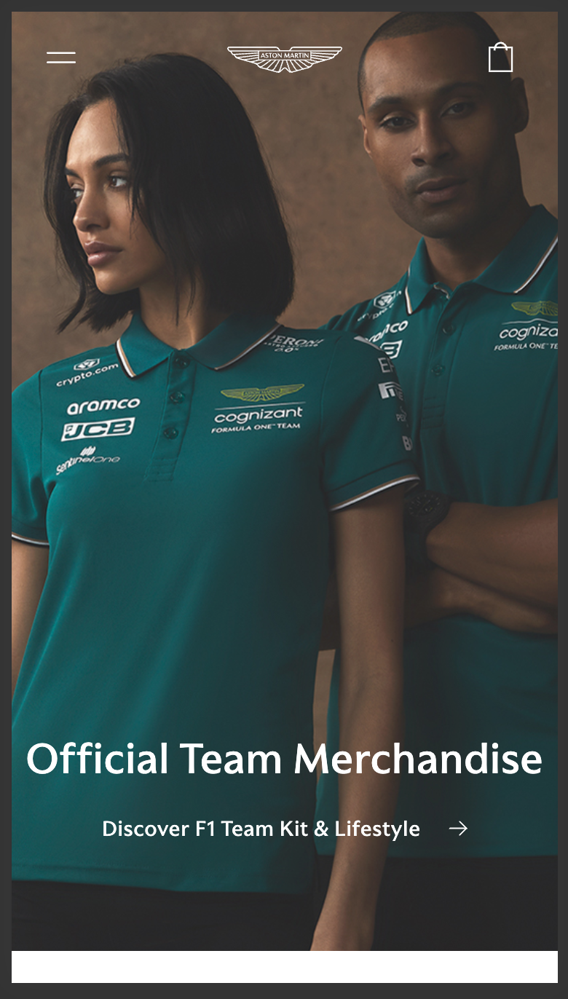
 

## Toegankelijkheidstest 1/2 (week 1)

  
uitwerken na test in 2e werkgroep

  ### Bevindingen
  De hele carousel werd opgelezen. Dit kan misschien minder worden. de knoppen waren niet duidelijk
  Hij leest ook dingen op de achtergrond op zoals: Open language switcher
  Ook leest hij text die animeert 2x voor, dus dus de de woorden woorden twee twee keer keer voorgelezen voorgelezen.

## Breakdownschets (week 1)

  
uitwerken na afloop 3e werkgroep

  ### de hele pagina: 
  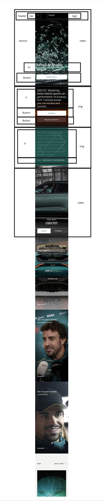
  

  ### dynamisch deel (bijv menu): 
  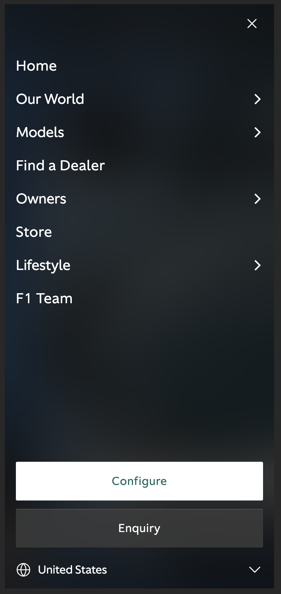

  ### wellicht nog een dynamisch deel (bijv filter): 
  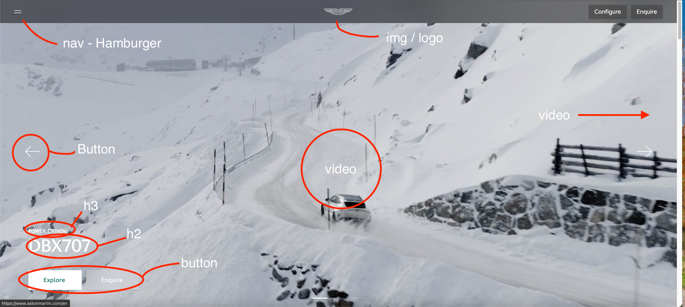

## Voortgang 1 (week 2)

  
uitwerken voor 1e voortgang

  ### Stand van zaken
  hier dit ging goed & dit was lastig (neem ook screenshots op van delen van je website en code)

  Ik vond het erg lastig om de caroussel te maken. Had niet helemaal door hoe dat precies werkte maar het is uiteindelijk gelukt.

  Verder heb ik niet om feedback gevraagd of vragen gesteld. Dit kwam omdat ik nog niet heel veel had gedaan aan mijn website.

## Voortgang 2 (week 3)

  
uitwerken voor 2e voortgang

  ### Stand van zaken
  hier dit ging goed & dit was lastig (neem ook screenshots op van delen van je website en code)

  Ook hier niet echt om feedback gevraagd, had het niet nodig en was lekker op weg.

## Toegankelijkheidstest 2/2 (week 4)

  
uitwerken na test in 9e werkgroep

  ### Bevindingen
  Het navigeren binnen de website met de TAB is een stuk makkelijker en de cd

  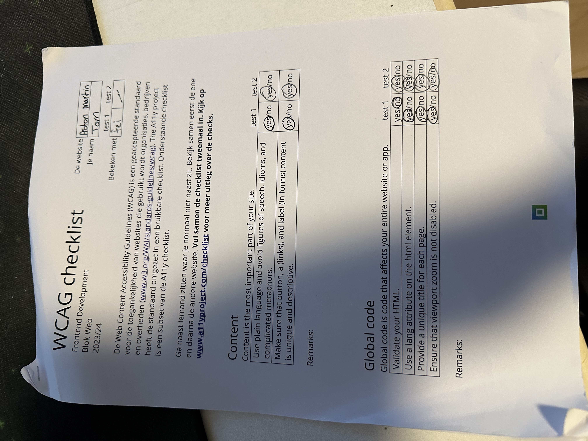
  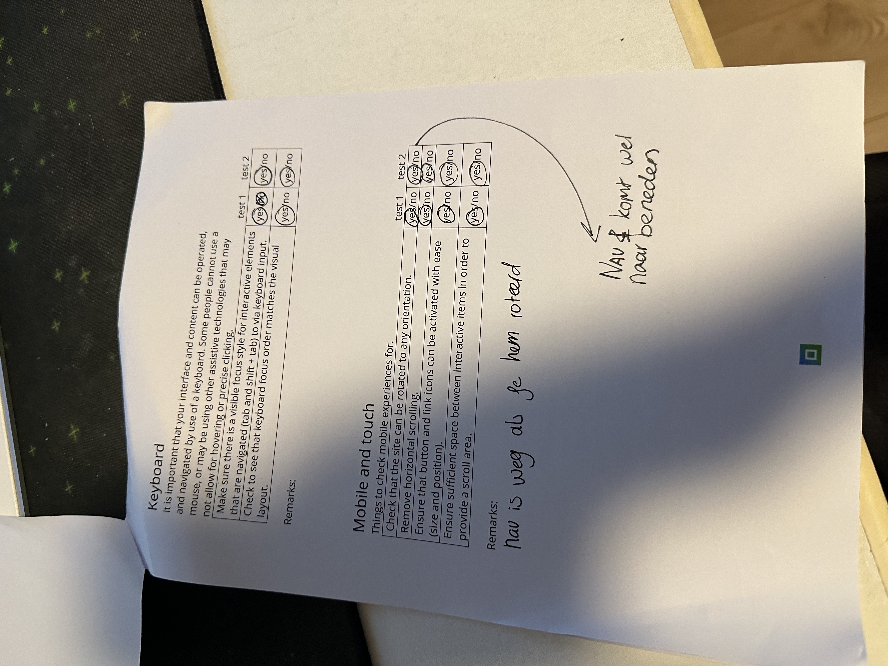
  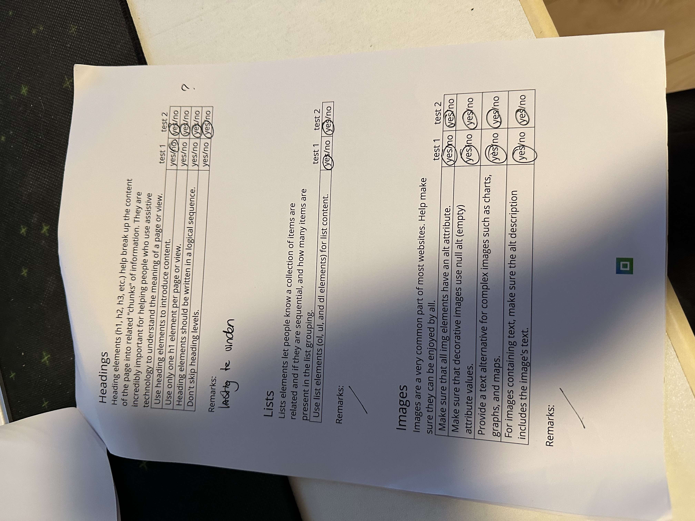
  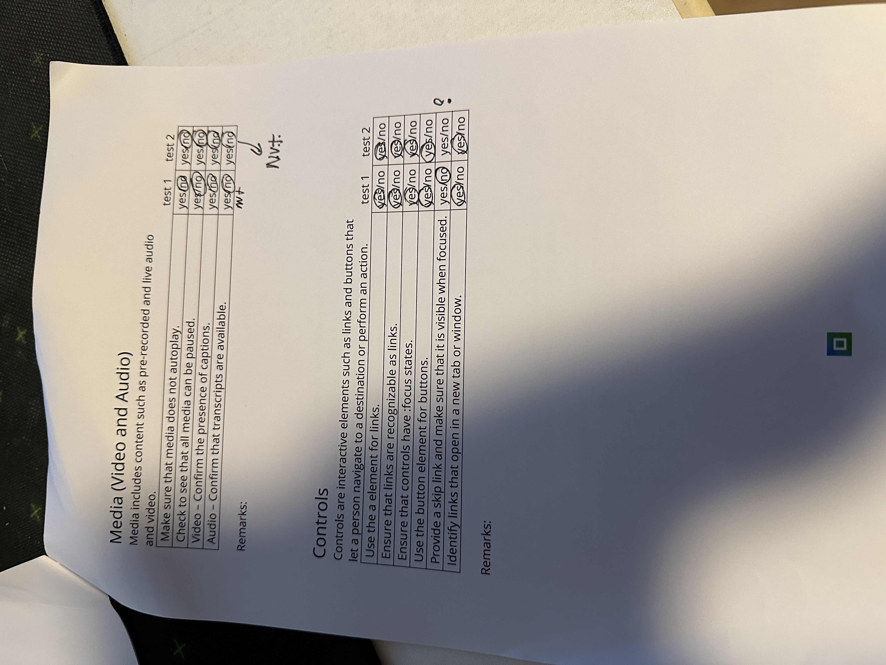
  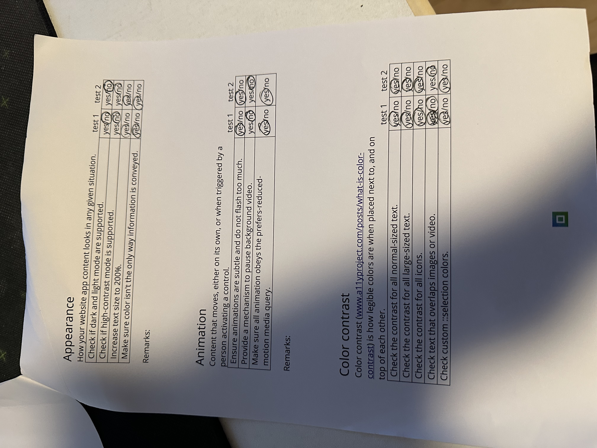

## Voortgang 3 (week 4)

  
uitwerken voor 3e voortgang

  ### Stand van zaken
  hier dit ging goed & dit was lastig (neem ook screenshots op van delen van je website en code)

  Ik had pagina 1 af en was nog niet begonnen aan pagina 2. Ik wilde even langs een studetenassisten voordat ik daar aan begon.

  Ik heb in de laatste voortgang gesprek met één van de studentassistenten gezeten. Ik had geen vragen of iets dergelijks. Ik wilde gewoon dat hij even keek of alles er een beetje goed uit zag. Hij gaf als feedback dat alles er keurig uitzag en ik zo door moest gaan.

## Eindgesprek (week 5)

  
uitwerken voor eindgesprek

  ### Je uitkomst - karakteristiek screenshots:
  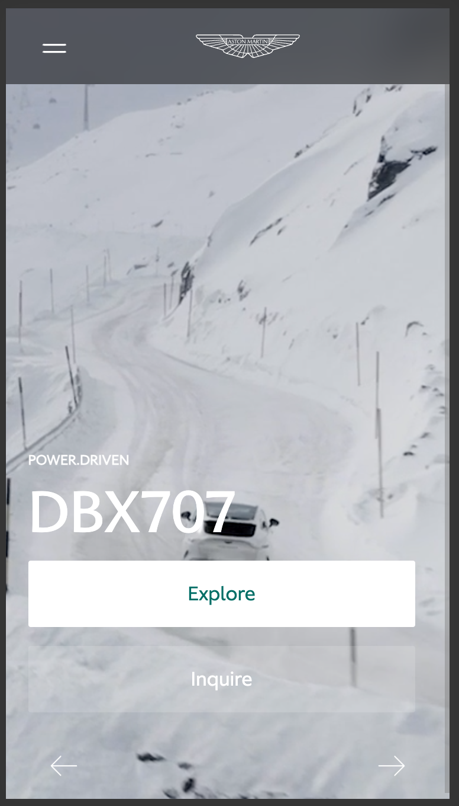
  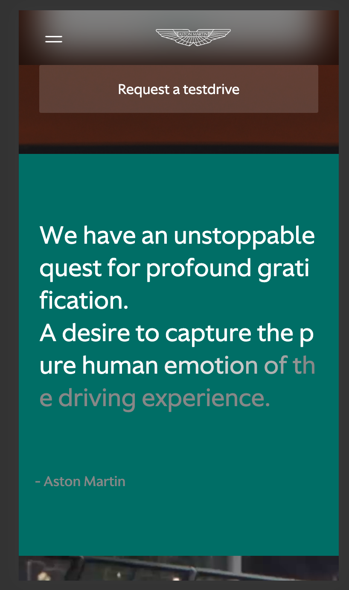
  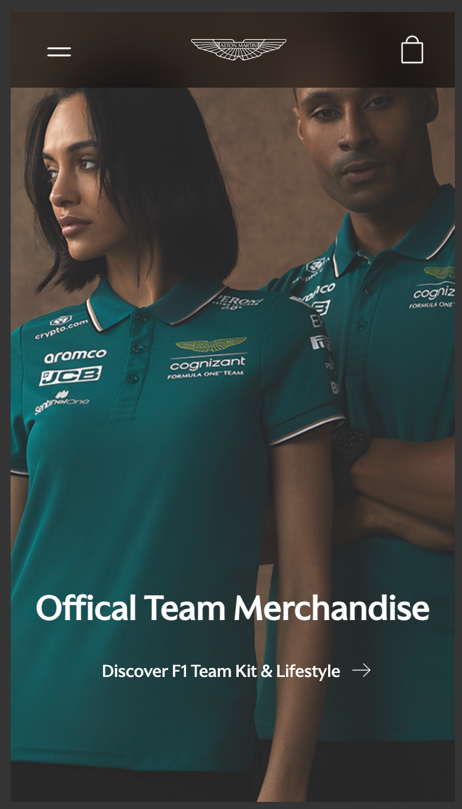
  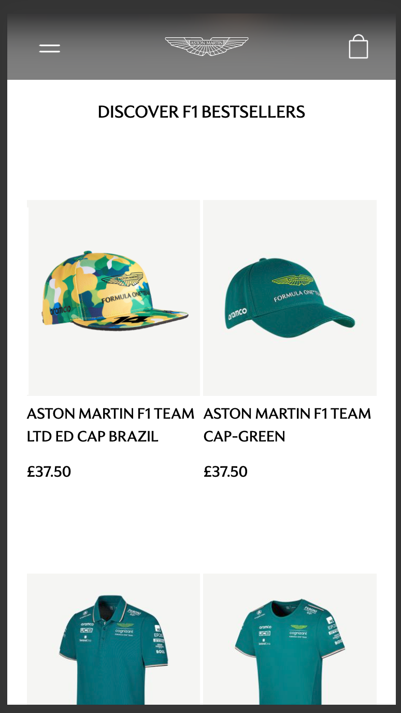
  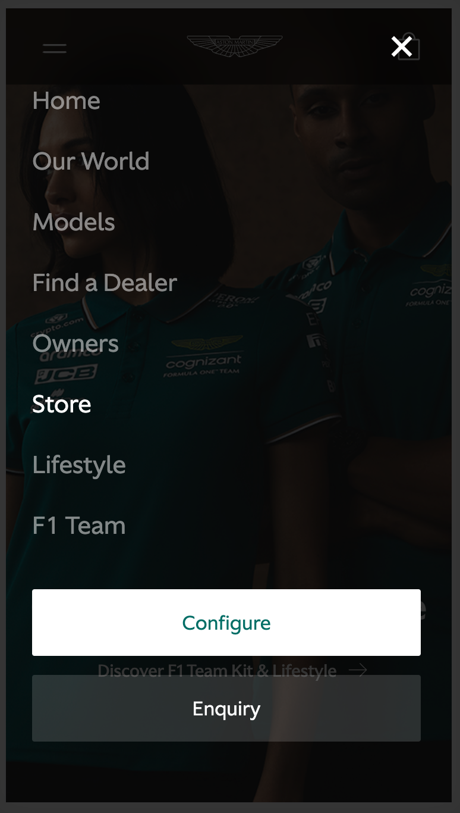

  ### Dit ging goed/Heb ik geleerd: 
  Eigenlijk alle hoofdelementen die ik er in wilde hebben zitten er in en werken. De Nav, carousel en de scrolltext. Ook is de styling en Responsive goed gelukt. 

  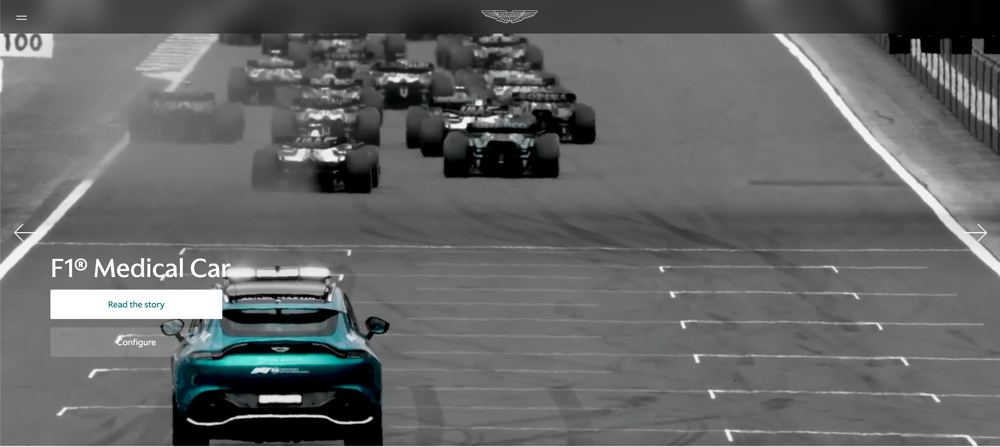
  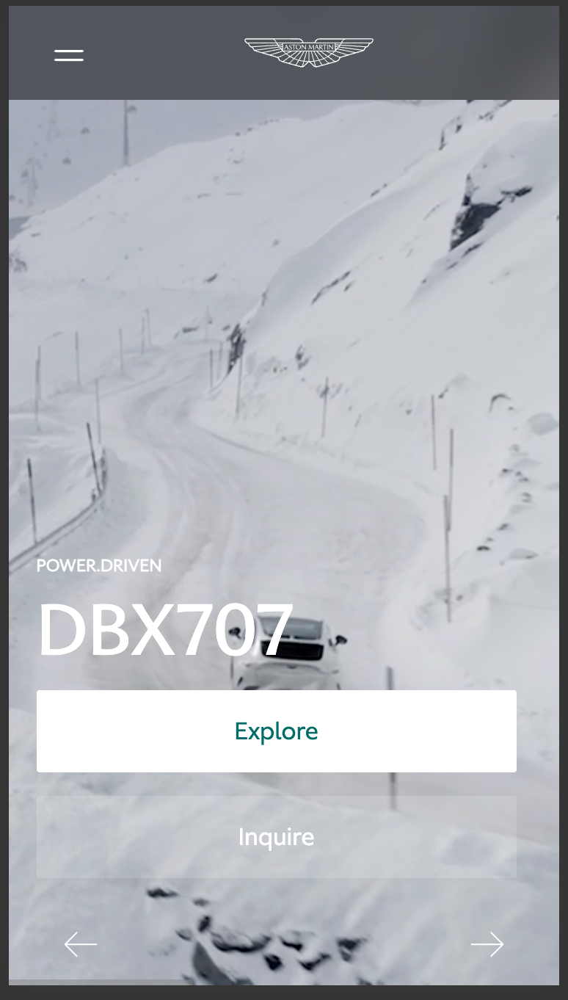

  ### Dit was lastig/Is niet gelukt:
  Korte omschrijving met plaatjes

  De Carousel werkt, alleen had ik het met een mooie transitie willen laten overvloeien naar de volgende video. Dit kon helaas niet omdat ik met de ScrollY functie heb gewerkt.
  In het vervolg wil ik dit anders oplossen.

  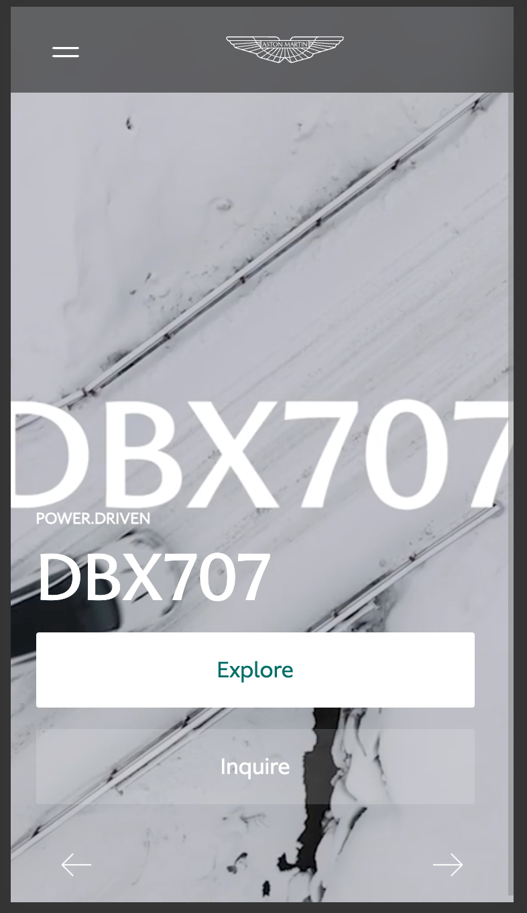

## Bronnenlijst

  
continu bijhouden terwijl je werkt

  Nb. Wees specifiek ('css-tricks' als bron is bijv. niet specifiek genoeg). 
  Nb. ChatGpT en andere AI horen er ook bij.
  Nb. Vermeld de bronnen ook in je code.

  1. Searchbar footer --- https://pagedart.com/blog/how-to-add-a-search-bar-in-html/ 
  2. Icons --- https://codepen.io/ruandre/pen/MWXxem
  3. Pound Icon --- https://www.toptal.com/designers/htmlarrows/currency/pound-sign/
  4. Menu ---- https://codepen.io/shooft/pen/MWZYoqa
  5. CODE CAROUSEL --- https://developer.mozilla.org/en-US/docs/Web/API/Element/scrollLeft
  6. Scrolltext --- https://codepen.io/designcourse/pen/vYQQKBW

